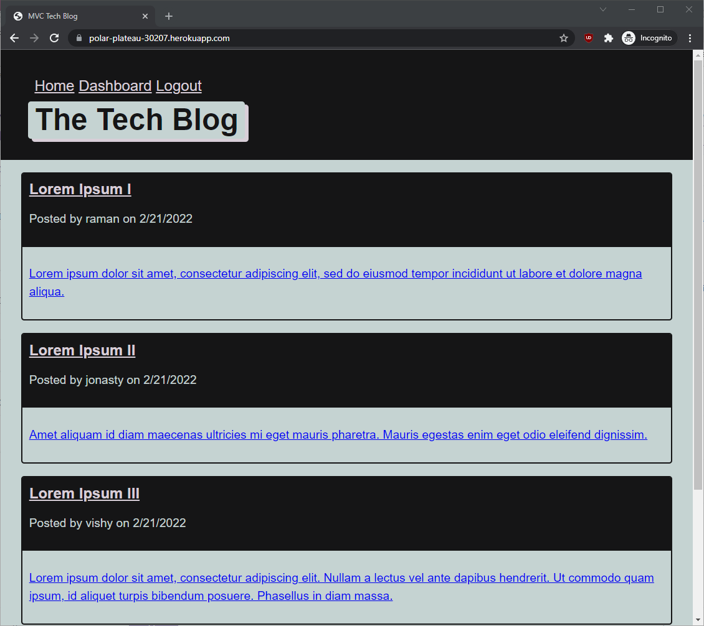

# RVT Tech Blog
This application creates a blogging site where Programmers and Technical folks can publish their blog posts and comment on other's posts.

## Table of contents
  - [Table of contents](#table-of-contents)
  - [General info](#general-info)
  - [Deployed Application](#deployed-application)
  - [Screenshots](#screenshots)
  - [Setup](#setup)
  - [Code and Technologies](#code-and-technologies)
  - [Licenses](#licenses)
  - [Developer(s)](#developers)

## General info
This Tech Blog application follows the classic MVC paradigm. It uses Handlebars.js as the templating language, Sequelize ORM for Object Relational Mapping and the express-session package for Authentication.

## Deployed Application
[RVT Tech Blog](https://polar-plateau-30207.herokuapp.com/)

## Screenshots

## Setup
* Clone GitHub repository 
* run npm install
* Open up MySQL shell and run: source .db/schema.sql
* Optionally run: npm run seed (to create some seed data)
* Run 'npm start' to start the application.
* Open browser and go to - http://localhost:3001

## Code and Technologies
* [Javascript](https://www.javascript.com/)
* [Node.js](https://nodejs.org/en/)
* [Sequelize](https://www.npmjs.com/package/sequelize)
* [MySQL2](https://www.npmjs.com/package/mysql2)
* [Express](https://www.npmjs.com/package/express)
* [Dotenv](https://www.npmjs.com/package/dotenv)
* [connect-session-sequelize](https://www.npmjs.com/package/connect-session-sequelize)
* [Express-Handlebars](https://www.npmjs.com/package/express-handlebars)
* [bcrypt](https://www.npmjs.com/package/bcrypt)

## Licenses
 
 

## Developer(s)
* [Raman TV.](https://github.com/ramantv)
